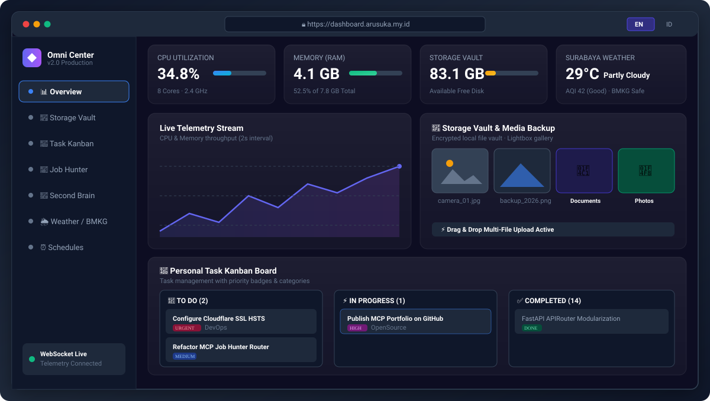

<div align="center">

# 🚀 Omni Command Center & Storage Vault

<p align="center">
  <strong>Modern, modular, privacy-first personal server command center, encrypted media vault, and real-time telemetry dashboard.</strong>
</p>

[](https://www.python.org/)
[](https://fastapi.tiangolo.com/)
[](https://react.dev/)
[](https://tailwindcss.com/)
[](https://developer.mozilla.org/en-US/docs/Web/API/WebSockets_API)
[](LICENSE)

<br />



</div>

---

## ✨ Features & Architecture

1. **📊 Live Server Telemetry & Health Stream**:
   - High-frequency CPU, Memory, Disk usage, Uptime, and Network I/O metrics streamed via WebSockets every 2 seconds.
   - Fail2ban intrusion defense health & security jail status inspector.

2. **📸 Storage Vault & Media Backup Gallery**:
   - Isolated private file storage with strict anti path-traversal protection.
   - Dual-view interface: **Photo & Media Gallery** (with full-resolution Lightbox viewer) and **File Explorer** (breadcrumbs, table view).
   - Drag & drop multi-file uploader with live streaming progress bar.
   - Folder creation, file renaming, download, and delete operations.

3. **📝 Personal Task Kanban Board**:
   - SQLite WAL-backed Kanban board with urgent priority tags, status columns, categories, and due dates.

4. **💼 Career & Job Hunter Tracker**:
   - Complete pipeline tracking (Wishlist, Applied, Screening, Technical Test, Interview, Offer, Rejected) with interview schedules.

5. **🧠 Second Brain & Knowledge Graph**:
   - Interactive search and preview of Obsidian markdown vault notes, concepts, and persistent rules with automated privacy redaction.

6. **🌦️ Weather & BMKG Earthquake Guardian**:
   - Hyper-local live weather forecast, AQI (Air Quality Index), and real-time BMKG earthquake early warning alerts for Indonesia.

7. **🏃 Zepp / Amazfit Smartwatch Health Sync**:
   - Live synchronization with Amazfit wearable metrics (daily step count, calorie burn, heart rate, sleep stages).

8. **🛡️ Enterprise-Grade Security & Hardening**:
   - Dual-layer anti brute-force login rate limiting (FastAPI sliding window limiter).
   - Session Cookie Authentication with PBKDF2-HMAC-SHA256 password hashing and HMAC-signed tokens.
   - Strict CORS whitelist and dynamic HTTPS `secure=True` cookie attributes.

---

## 🛠️ Tech Stack

- **Backend**: Python 3.14+, FastAPI, Uvicorn, SQLite (WAL mode), WebSocket, Psutil
- **Frontend**: React 19, Vite, Tailwind CSS, Lucide React, i18next (English & Bahasa Indonesia)
- **Reverse Proxy & Security**: Nginx, Let's Encrypt SSL/TLS, Fail2ban, UFW

---

## 🚀 Quick Start (Run Anywhere)

This repository is 100% portable and plug-and-play across Linux, macOS, and WSL environments.

### 1. Clone & Prerequisites
```bash
git clone https://github.com/fahmirizal229/omni-command-center.git
cd omni-command-center
```

### 2. Backend Setup
```bash
# Create and activate virtual environment (Optional)
python3 -m venv venv
source venv/bin/activate

# Install dependencies
pip install -r requirements.txt

# (Optional) Customize environment paths
cp .env.example .env
```

### 3. Frontend Setup & Build
```bash
cd frontend
npm install
npm run build
cd ..
```

### 4. Run Application
```bash
python3 app.py
```
Open `http://127.0.0.1:8888` in your browser. Master admin credentials are automatically initialized on the first run (`arusuka` / `arusuka123`).

---

## 📁 Repository Structure

```
omni-command-center/
├── app.py                     # Main application entry point & SPA static files server
├── requirements.txt           # Python dependencies
├── assets/
│   └── preview.svg            # High-resolution dashboard UI vector preview
├── backend/
│   ├── config.py              # Dynamic configuration & path resolver
│   ├── database.py            # SQLite database initializer & connection helper
│   ├── security.py            # PBKDF2 auth, HMAC session tokens & rate limiter
│   ├── websocket.py           # Real-time WebSocket connection manager & telemetry loop
│   └── routes/                # Modular domain API routers
│       ├── auth.py            # Authentication & session endpoints
│       ├── overview.py        # System health & dashboard summaries
│       ├── storage.py         # Storage vault & photo upload/preview/download
│       ├── tasks.py           # Personal Kanban board CRUD
│       ├── jobs.py            # Job Hunter career tracker CRUD
│       ├── second_brain.py    # Obsidian note explorer & knowledge graph
│       ├── weather.py         # Weather & BMKG earthquake monitoring
│       ├── zepp.py            # Amazfit/Zepp health metrics
│       └── schedules.py       # Cron routines & daemon inspector
└── frontend/                  # React 19 + Vite + Tailwind CSS SPA UI
```

---

## 🔒 License
MIT License © 2026 Muhammad Fahmi Rizal ([@fahmirizal229](https://github.com/fahmirizal229)).
